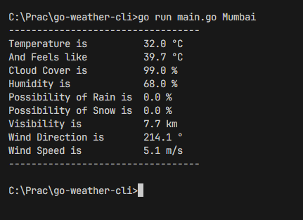
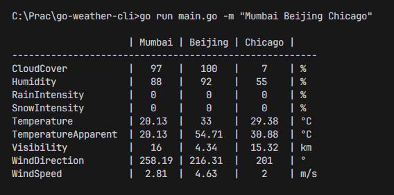
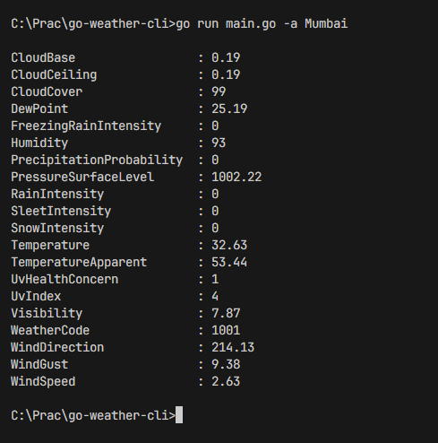

# Go Weather CLI

## Overview

The Go Weather CLI is an application written in Go that fetches and displays weather data for specified cities using external APIs. It provides both interactive and non-interactive modes for fetching weather data.

## Features

1. **Interactive Mode :** Allows the user to input city names and get weather data in real-time.
2. **Non-Interactive Mode :** Fetches weather data for a single city or multiple cities via command-line arguments.
3. **Fetch Common Weather Data :** Retrieves common weather data points (e.g., temperature, humidity, wind speed).
4. **List All Data Points :** Option to list all available weather data points.

## Usage

### Interactive Mode

Run the program without any arguments to enter interactive mode.

```sh
go run main.go
```

- Enter the city name to fetch weather data.
- Type 'x' to exit the interactive mode.


### Non-Interactive Mode

Use command-line flags to fetch weather data for one or more cities.

#### Fetch Common Weather Data for a Single City

```sh
go run main.go Mumbai
```



#### Fetch Common Weather Data for Multiple Cities

```sh
go run main.go -m "Mumbai Bangalore California"
```



#### List all data points for a Single City

```sh
go run main.go -a Mumbai
```



#### List all data points for a Multiple Cities

```sh
go run main.go -a -m "Mumbai Beijing Chicago"
```


### Compiling the Application

The app can be compiled into an executable using :

```sh
go build -o gwe.exe main.go
```

Then, you can use the gwe command to run the application :

```sh
gwe -m "Mumbai Beijing Chicago"
```


## How it works

### Data Flow

1. main.go

   - Parses command-line arguments
   - Determines the mode of operation (interactive or non-interactive)
   - Calls the appropriate functions from the `utils` package to fetch and display weather data

2. GeoCodingAPIClient.go

   - Fetches the latitude and longitude of a given city using the LocationIQ API

3. WeatherAPIClient.go

   - Uses the latitude and longitude to fetch weather data from the Tomorrow.io API

4. CommonWeather.go

   - Extracts common weather data points from the API response and prints them

5. MultipleCities.go
   - Fetches weather data for multiple cities concurrently using goroutines and channels
   - Prints the common weather data points for multiple cities in a formatted table

## Important Links

- Weather API : [Tomorrow.io Weather API Documentation](https://docs.tomorrow.io/reference/weather-forecast)
- GeoCoding API : [LocationIQ Geocoding API Documentation](https://docs.locationiq.com/reference/search)

### Known Issues

**Error converting GeoCoding response body to JSON struct...**

- The APIs may fail every once in a while. It is suggested to use some other API which has low occurrences of failure
